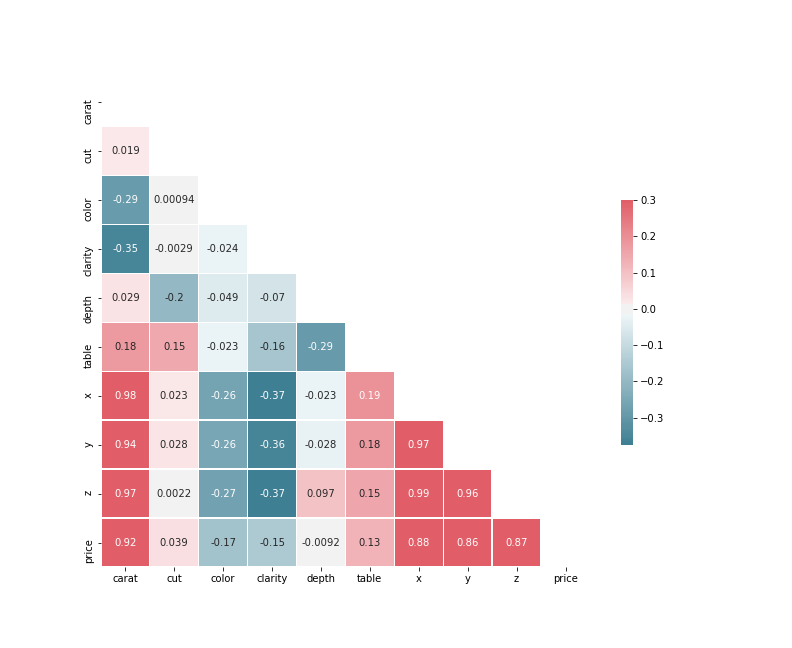

# kaggle-competition
## Encontrar el mejor modelo para predecir el precio de los diamantes

## 1. Introducción

El objetivo de este proyecto consiste en encontrar el modelo de regresión que mejor estime el precio de un diamente basado en las siguientes características:

* **Carat**: es el peso de la piedra.

* **Color**: el grado de ausencia de color

* **Cut**: las proporciones del diamante

* **Claridad**: la presencia o ausencia de inclusiones en el diamante.

* **Depth**: altura del diamente

* **Table**: anchura de la cara superior.

* **x, y, z**: medidas

Para ello, contamos con un dataset compuesto de  ... entradas que relacionan estas características y el precio alcanzado por el diamante.

## Materiales y métodos

### Análisis de los datos

El primer paso fue ver los datos, su estructura y sus relaciones entre variables.

Estadística básica

|       |        carat |         cut |       color |     clarity |       depth |       table |           x |           y |            z |    price |
|:------|-------------:|------------:|------------:|------------:|------------:|------------:|------------:|------------:|-------------:|---------:|
| count | 40345        | 40345       | 40345       | 40345       | 40345       | 40345       | 40345       | 40345       | 40345        | 40345    |
| mean  |     0.795652 |     3.55385 |     4.41324 |     4.05802 |    61.7504  |    57.4603  |     5.72611 |     5.73022 |     3.53514  |  3924.09 |
| std   |     0.470806 |     1.02692 |     1.69524 |     1.64864 |     1.42422 |     2.23533 |     1.11869 |     1.14858 |     0.693662 |  3982    |
| min   |     0.2      |     1       |     1       |     1       |    43       |    43       |     0       |     0       |     0        |   326    |
| 25%   |     0.4      |     3       |     3       |     3       |    61       |    56       |     4.71    |     4.72    |     2.91     |   948    |
| 50%   |     0.7      |     3       |     4       |     4       |    61.8     |    57       |     5.69    |     5.71    |     3.52     |  2395    |
| 75%   |     1.04     |     4       |     6       |     5       |    62.5     |    59       |     6.54    |     6.53    |     4.03     |  5313    |
| max   |     4.01     |     5       |     7       |     8       |    79       |    95       |    10.02    |    58.9     |     8.06     | 18818    |

Heatmap con las correlaciones entre las distintas variables:

Se observa que x,y,z están muy correlacionadas entre sí y que el precio apenas está relacionado con 